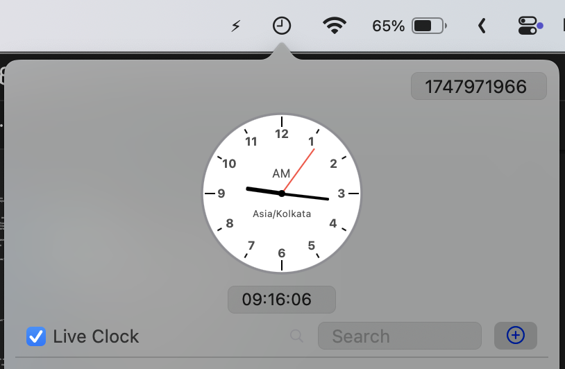

# TheirTime

## Overview

TheirTime is a macOS menu bar application designed to help you keep track of time across different time zones around the world. Perfect for remote teams, global families, or anyone who needs to coordinate across time zones, TheirTime provides an elegant, efficient way to visualize and manage multiple time zones from your menu bar.

## Key Features

- **Menu Bar Integration**: Quick access from your macOS menu bar, always just a click away
- **Multiple Time Zones**: Add and manage clocks for any time zone in the world
- **Custom Clock Names**: Personalize each clock with custom names for easy identification
- **Tagging System**: Tag clocks with names of people, teams, or locations for easy filtering
- **Analog & Digital Display**: View time in both analog clock face and digital time format
- **Search Functionality**: Quickly find clocks by name or tag
- **Import/Export**: Share your clock configurations or back them up
- **Manual Time Entry**: Set specific times to see corresponding times in all zones
- **Epoch Time Support**: Work with Unix epoch timestamps directly for technical use cases
- **Live Clock Mode**: Toggle between live time updates and fixed time reference
- **Date & Time Input Fields**: Enter specific dates and times for precise coordination

## Installation

### Method 1: Build from Source
1. Clone the repository: `git clone https://github.com/jayakrishnancn/TheirTime.git`
2. Open the project in Xcode: `open TheirTime/TheirTime.xcodeproj`
3. Build the application (⌘+B) and run (⌘+R)
4. Archive and export the application for personal use

## Usage Guide

### Adding a New Clock
1. Click on the TheirTime icon in your menu bar
2. Click the "+" button
3. Select a time zone from the dropdown menu
4. Give the clock a name (e.g., "New York Office" or "Tokyo Team")
5. Click "Add" to create the new clock

### Adding Tags to Clocks
1. Click on a clock to select it
2. In the tag management section, enter a new tag (e.g., "Team Alpha", "Family", "Client")
3. Press Enter or click the "+" button to add the tag
4. Use tags to filter and find clocks quickly

### Searching Clocks
- Use the search bar to filter clocks by name or tags
- Separate multiple search terms with commas (e.g., "Tokyo, Team Alpha")

### Setting Custom Time
- Enter a specific time in the time field (format: HH:MM:SS)
- Enter a specific date in the date field (format: YYYY/MM/DD)
- Toggle "Live Clock" off to keep the time fixed

### Working with Epoch Time
- Enter a Unix timestamp in the Epoch field to convert it to human-readable time across all time zones
- The app automatically detects and converts between seconds and milliseconds based on value magnitude

### Import and Export
1. Click the settings icon to open the Import/Export panel
2. To export: Click "Export" and select a location to save your clock configurations
3. To import: Click "Import", select a previously exported TheirTime configuration file
4. Imported clocks will be merged with your existing configuration, avoiding duplicates

## Import/Export Format

TheirTime saves clock configurations as JSON files containing:
- Time zone identifiers
- Custom names
- Associated tags

This makes it easy to share configurations with teammates or transfer between devices.

## Keyboard Shortcuts (Future Enhancement)
- `⌘+F`: Focus the search field
- `⌘+N`: Add a new clock
- `⌘+E`: Toggle live clock mode
- `⌘+I`: Open import/export panel

## Requirements

- macOS 14.0 (Sonoma) or later
- Approximately 10MB of disk space

## FAQ

### Q: Can I sync my configurations between multiple Macs?
A: Use the Export/Import feature to manually transfer your configurations. Cloud synchronization is planned for a future update.

### Q: How accurate is the time displayed?
A: TheirTime uses the system's time and time zone database, which are regularly updated by macOS.

### Q: Can I use TheirTime for time tracking?
A: TheirTime is designed for time zone visualization rather than time tracking. It does not currently include time tracking features.

### Q: Does TheirTime support Daylight Saving Time changes?
A: Yes, TheirTime automatically handles Daylight Saving Time changes based on the system's time zone database.

## License

TheirTime is released under the MIT License. See the [LICENSE](LICENSE) file for details.

---

## Development

TheirTime is built with SwiftUI and designed for macOS. Contributions are welcome! Please see the [CONTRIBUTING](CONTRIBUTING.md) guide for details on how to help improve TheirTime.

Created with ❤️ by Jayakrishnan
